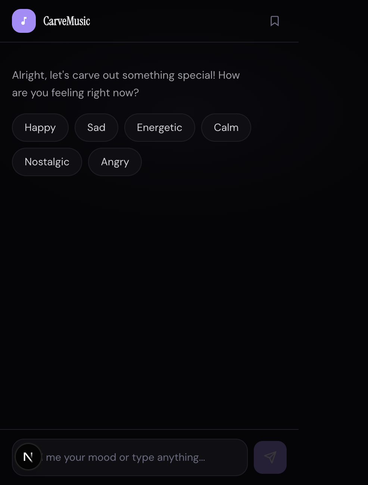
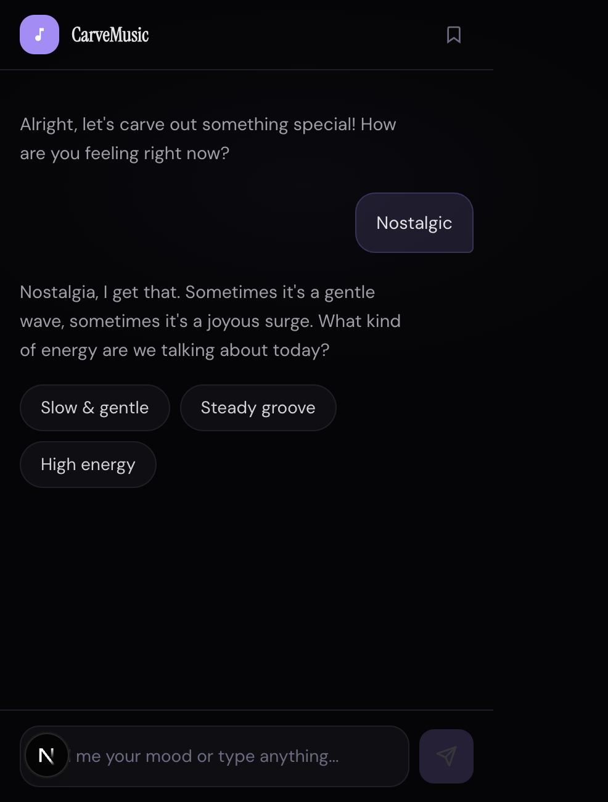
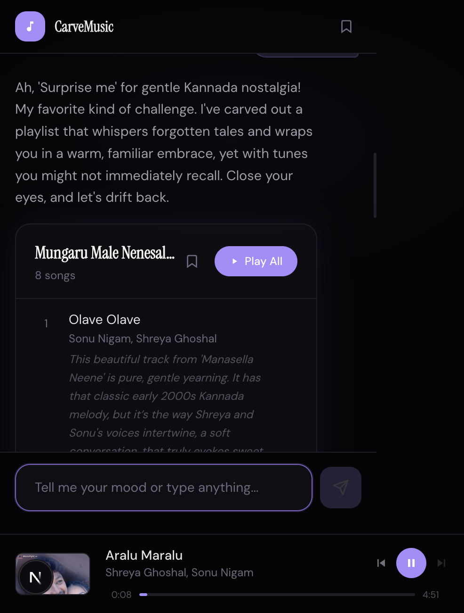

# CarveMusic

**Tell it how you feel. It builds the playlist.**

CarveMusic is a chat-based playlist curator. Instead of searching for songs, you describe your mood — "I feel like driving on an empty highway at night" — and the AI builds a playlist of songs you'd never find on your own.

It doesn't give you the same 10 popular songs every app does. It digs deeper.

---

### How it works

1. You chat with the AI about your mood (or pick from quick MCQ buttons)
2. It searches the web and a real music database to find songs that actually exist
3. It sequences them into an emotional arc — not a random list, a journey
4. You refine through conversation: "remove track 3", "more like track 5", "too slow"
5. Hit play — songs stream via YouTube right in the app

### What makes it different

- **Mood, not keywords.** You can't type "balcony chai rainy evening" into Spotify. You can here.
- **Real songs, not hallucinated ones.** Gemini + Google Search grounding + JioSaavn data means the AI recommends songs that actually exist with correct titles and artists.
- **Hidden gems over obvious hits.** It prefers the beautiful song from the movie nobody saw over the one everyone already knows.
- **Regional music that works.** Kannada, Hindi, Tamil, Telugu — not just English and Bollywood top 40.
- **Thread following.** "That composer also scored this obscure 1993 film — track 4 is exactly what you need."

### Stack

- Next.js 14 (App Router, TypeScript)
- Google Gemini API with Google Search grounding
- JioSaavn unofficial API for verified song data
- YouTube IFrame Player for playback
- Tailwind CSS, dark theme

### Setup

```bash
git clone https://github.com/codingyoga/CarveMusic.git
cd CarveMusic
npm install
```

Create `.env.local`:

```
GEMINI_API_KEY=your-key-from-aistudio.google.com
YOUTUBE_API_KEY=your-youtube-data-api-key
```

```bash
npm run dev
```

Open `http://localhost:3000`.

### Get API keys

- **Gemini**: [Google AI Studio](https://aistudio.google.com/apikey) — free tier is generous
- **YouTube Data API**: [Google Cloud Console](https://console.cloud.google.com/) — enable YouTube Data API v3, create an API key

### Screenshots

<p align="center">
  
  &nbsp;&nbsp;
  
  &nbsp;&nbsp;
  
</p>

<p align="center">
  <em>Left:</em> Pick your mood with quick buttons &nbsp;|&nbsp;
  <em>Center:</em> Conversational flow to refine &nbsp;|&nbsp;
  <em>Right:</em> AI-curated playlist with YouTube playback
</p>

---

Built because every music app recommends the same songs and none of them let you just *talk* about how you feel.
